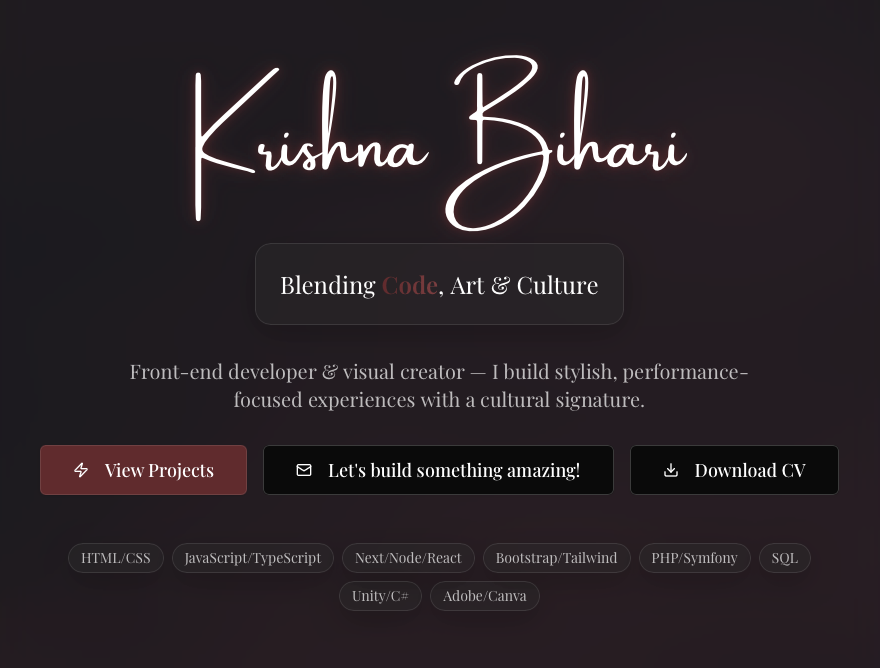

# Krishna Bihari – Creative Developer Portfolio

<p align="center">
  
</p>

<p align="center">
  <a href="https://astro.build"></a>
  <a href="https://www.typescriptlang.org/"></a>
  <a href="https://tailwindcss.com"></a>
  <a href="https://threejs.org"></a>
  
  
  
  
  
</p>

---

## ✨ Overview

A cinematic, minimalist portfolio blending **code, motion, and atmosphere**.

Designed as a sensory experience rather than a traditional interface —  
focused on **fluidity**, **depth**, and **visual calm**.

> *Minimal surface. Maximum presence.*

---

## 🚀 Live Experience

🌐 **View Portfolio**  
👉 https://kasbihari.github.io/

---

## ✨ Core Experience

### 🌌 Fluid Aurora Background  
Custom GPU-driven WebGL shader system with dynamic mouse interaction.

### 🧊 Dark Liquid Glass UI  
Consistent glass-morphism design language with bordeaux accents.

### 🌠 Interactive Skill Galaxy  
Pan & zoom through an animated skill constellation  
(Desktop + Touch Optimised).

### 🎬 Cinematic Page Transitions  
Seamless fades without disruptive reload behaviour.

### 📱 Fully Responsive  
Carefully tuned layouts across all breakpoints.

### ⚡ Performance-Driven  
Lazy-loaded Three.js, static rendering, GPU-efficient shaders.

### ♿ Accessibility-Focused  
Semantic HTML, contrast-safe palette, motion-aware interactions.

---

## 🛠 Technology Stack

| Category | Technologies |
|----------|-------------|
| **Framework** | Astro |
| **Language** | TypeScript (Strict Mode) |
| **Styling** | Tailwind CSS + shadcn/ui |
| **3D / WebGL** | Three.js + Custom GLSL Shaders |
| **Animations** | Framer Motion |
| **Icons** | Lucide React |
| **Deployment** | GitHub Pages (GitHub Actions) |

---

## 📁 Architecture

```
├── public/                # Static assets (images, fonts, cv.pdf)
├── src/
│   ├── components/
│   │   ├── 3d/            # WebGL / Three.js systems
│   │   ├── sections/      # Portfolio sections
│   │   ├── skills/        # Skill Galaxy module
│   │   └── ui/            # shadcn/ui components
│   ├── content/           # Structured data (skills)
│   ├── layouts/           # Layout wrappers
│   ├── pages/             # Routes
│   ├── styles/            # Global styling
│   └── lib/               # Utilities
├── astro.config.mjs
├── tailwind.config.mjs
├── tsconfig.json
└── package.json
```

---

## 🚀 Getting Started

### Prerequisites

- Node.js 20+
- npm

### Installation

```bash
git clone https://github.com/kasbihari/kasbihari.github.io.git
cd kasbihari.github.io
npm install
npm run dev
```

---

## 🌐 Deployment Pipeline

Automated deployment via **GitHub Actions**.

Every push to:

```
signature-version
```

Triggers:

✔ Build  
✔ Static Export  
✔ GitHub Pages Deployment  

Workflow:

```
.github/workflows/deploy.yml
```

---

## 🎨 Customisation Guide

| Element | Location |
|---------|----------|
| **Colors & Typography** | `tailwind.config.mjs`, `src/styles/global.css` |
| **Skills Data** | `src/content/skills/index.ts` |
| **Projects Section** | `Projects.tsx` |
| **Contact Section** | `Contact.tsx` |
| **Aurora Background** | `FluidAuroraBackground.tsx` |

---

## 🎯 Design Philosophy

This portfolio prioritises:

• Visual breathing space  
• Motion without noise  
• Depth without clutter  
• Interaction without friction  

The interface behaves more like an **environment** than a webpage.

---

## 🙏 Acknowledgements

Built with:

- Astro  
- Three.js  
- shadcn/ui  
- Framer Motion  

Crafted with ☕ and precision by **Krishna Bihari**

---

## 📄 License

MIT License
